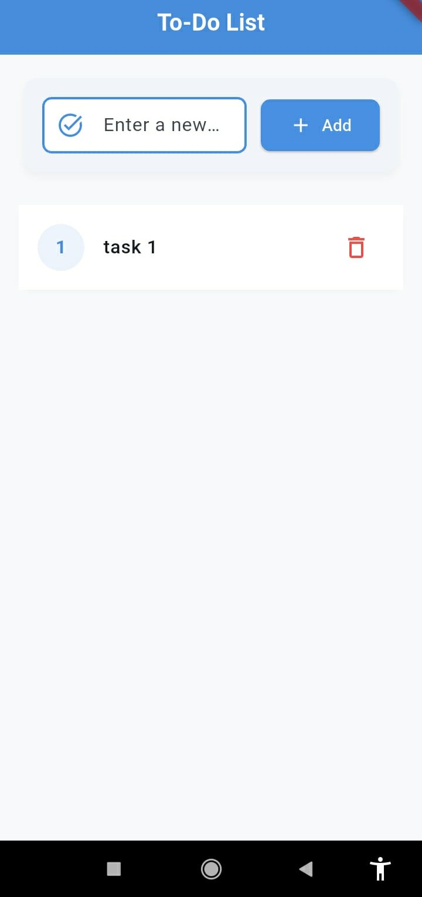
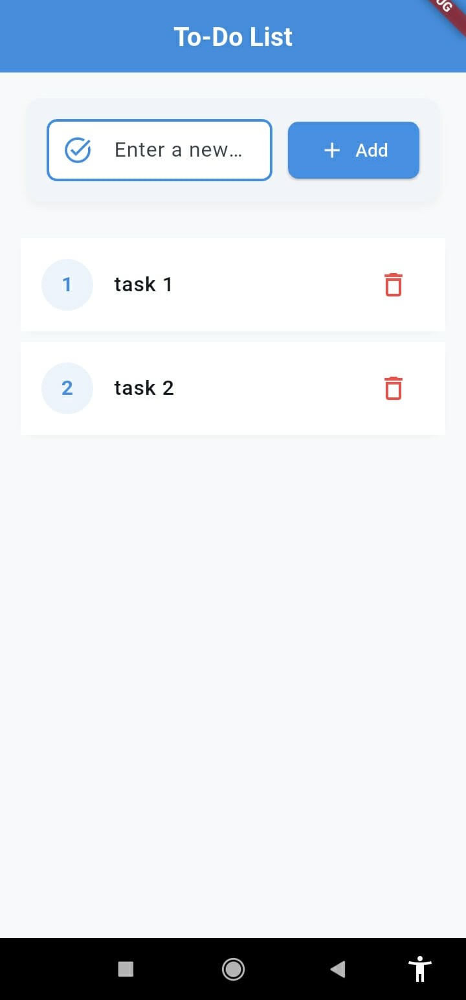
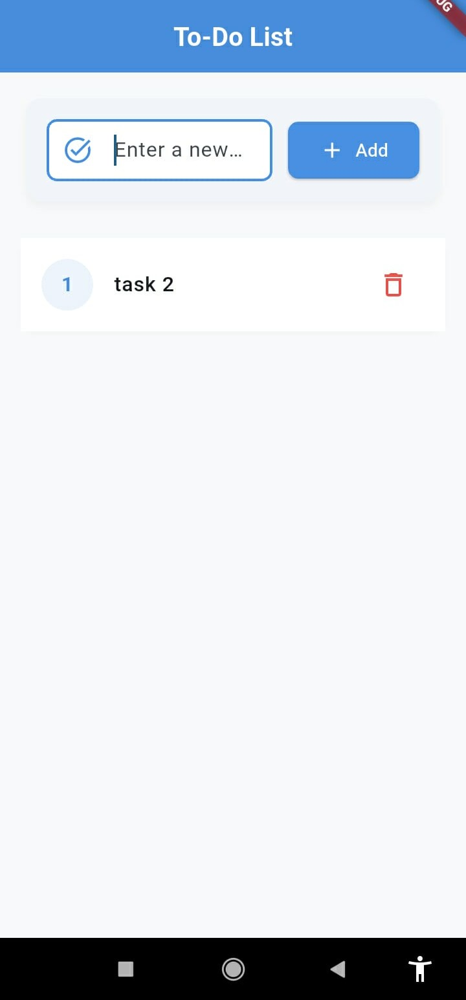

# 🚀 Cross-Platform To-Do List App
A simple cross-platform to-do list application built with Flutter, demonstrating single codebase development for multiple mobile platforms.

## 🌟 Features
- **Cross-Platform**: Single Flutter codebase runs on Android and iOS
- **Task Management**: Add, view, and delete tasks with ease
- **Modern UI**: Beautiful light theme with Material Design 3

## 🔧 Technical Implementation
### 💁‍♂️ Flutter Framework Used
- **Flutter SDK**: Cross-platform UI framework by Google
- **Dart Programming Language**: Modern, type-safe language
- **Material Design 3**: Latest design system for consistent UI
- **Widget-Based Architecture**: Reusable UI components

### 🏠 Architecture
- **StatefulWidget**: Manages app state with setState()
- **Single Screen Design**: All functionality on one screen
- **Material Components**: TextField, ListView, Card, ElevatedButton
- **Modern Dart Syntax**: withValues() for color transparency

### 🔑 Key Components
- **TodoApp**: Root application widget with theme configuration
- **TodoListScreen**: Main screen with task management logic
- **Text Input Field**: Task entry with hint text and icons
- **Dynamic Task List**: Scrollable ListView with numbered items
- **Delete Functionality**: IconButton for task removal

## 📸 Screenshots
### Add Task

### Task List

### Delete Task

## 🎯 In Conclusion
This cross-platform to-do list application successfully demonstrates Flutter's ability to create beautiful, functional mobile apps from a single codebase. The project implements all minimum functional requirements with a modern, user-friendly design and is fully ready for laboratory submission.
